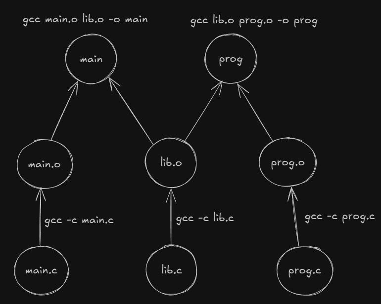

C is a 50 year old language. Much older than the majority of software engineers across the globe.
Despite still being very relevant, it is notorious for memory-related bugs that often have
[disastrous consequences](https://en.wikipedia.org/wiki/Therac-25). Although preventing bugs and insensible judgement are easier said than done,
even for seasoned programmers, understanding the core principles behind memory management
might just save you a grimace and a `Segmentation fault (core dumped)`.

### Compilation

The key to understanding low-level systems languages like C is to understand their memory management paradigm. But before we do that,
we must first understand what compilation is and how a C program is compiled (run). C is a statically-typed language. This means that we define
explicit types for each variable that we declare (integers, strings, etc.) and compile the program into an executable ahead-of-time (AOT).
This executable is a file that is in raw binary (1s and 0s) and is directly run
by the CPU. When we run the executable, we enter the runtime of the program. This
is where the code we wrote in our C program executes its instructions. If we need to bring
new code changes to effect, we would have to re-compile the program. 

This is different from languages like Python or JavaScript, which are dynamically-typed programming languages. They are not compiled to binary
executables AOT but instead compiled down to some lower-level representation (bytecode) _during
runtime_. Python has an interpreter that transforms the source code to bytecode and runs these
bytecode instructions one at a time in a separate runtime environment while JavaScript uses a
technique called JIT compilation that compiles the source code directly to machine code (not binary) at runtime and executes them in the browser.
JIT compilation also exists for Python if we use PyPy. All of this means that their code is not run directly
on the hardware, unlike C, making them magnitudes slower.

There are several keywords in a C program that start with the `#` symbol. These are called preprocessor directives (more on them later in 
the section). Out of these, the `#define` keyword is used to declare macros. Macros are simply text-substituted functions that do
not enforce type-checking. Let's explore what this means.

```c
#define SQUARE(x) (x * x)
```

Unlike normal functions, macros are copy-pasted (substituted) into the main code wherever they are called. They are not pushed onto
the call stack and hence cannot return values like a traditional function. Thus, it is important to ensure that
macros (mostly) expand to something that produces a value (an expression instead of a statement) by wrapping them in parentheses. 

```c
int a = 4;
int square_a = SQUARE(a); // int square_a = (4 * 4)
int square_increment = SQUARE(a++); // int square_increment = (x++ * x++) = (5 * 6); (not 5 * 5)

```

As the type of the arguments passed is left unchecked, macros can be seen as generic implementation of functions that are prevalent in modern 
programming languages like TypeScript or Rust. But notice how the last statement produces an unexpected result.

Macros need not always produce a value. We can have multi-line statement macros that carry out 
side effects (like printing while debugging). To ensure the text-substitution works without breaking the syntax, 
a standard trick is to wrap them in a do-while loop that runs once. 

```c
#define SWAP(a, b) do { \
    int temp = a;       \
    a = b;              \
    b = temp;           \
} while(0)

```

This is now safe to be substituted for both of the following cases.

```c 
if (cond)
    SWAP(a, b);
else
    printf("no swapping\n");

// 2

if (cond) {
    SWAP(a, b);
} else {
    printf("no swapping\n");
}

```

Macros are sometimes used to "select" certain functions when combined with conditional compilation. This basically decides
which code is to be included for compilation. It is done using directives like `#ifdef` or `#ifndef`.

```c
#define V8
// #define custom_engine

#ifndef custom_engine 
    void engine() {
        printf("running v8")
    }
#else 
    void engine() {
        printf("running custom")
    }
#endif

```

The compilation pipeline of a C program can be broken down into $$ 4 $$ steps.

1. Preprocessing - The C preprocessor takes care of the preprocessor directives. It transforms the source code by 
   expanding the `#include` header files, stripping comments, replacing macros with their raw implementations and handling conditional compilation. 
2. Compiling - The compiler takes the preprocessed code and compiles it down
   to native assembly instructions for the target architecture.
3. Assembling - The assembler converts the assembly code into machine code (object files).
4. Linking - Links the object files and libraries to create the final executable.

A C program typically contains header files (ending with .h) and source files (ending with .c). Source files
contain the actual source code run by the program while their corresponding header files contain the function signatures and macros used 
in the source file. These header files can be imported and shared across multiple source files.

```c
// hello.c
void greet(char name[]) {
    printf("%s", name)
}

// hello.h
void greet(char name[])

// main.c
#include "hello.h"
int main() {
    char name[] = "swagatmitra"
    greet(name)
}
```
These files can be compiled into a single executable (main) using the command `gcc main.c hello.c -o main`.



The advantage of compiling source files to object files as an intermediate step instead compiling to the executables directly can be understood when 
we look at a dependency graph. In the image above, as both the `prog` and `main` executables depend on the lib.c source file, we would need to
re-compile the same file twice every time it changes. To save us such redundant re-compilation, we can instead re-compile the source file to
the lib.o object file once and then simply re-link the object file to the respective executables. 

Due to this slightly convoluted pipeline, developers mostly use tools like Makefiles or CMake that streamline this build process 
and make it a lot easier to work with C projects. I personally prefer Makefiles over CMake as I find the latter full of abstractions
that makes it unnecessarily complicated for small to medium-sized projects. But Makefiles are a charm! Their coolest feature is that 
they are language-agnostic. Once you understand how they work, you can put them to use anywhere. Here is an [awesome resource](https://makefiletutorial.com/)
on Makefiles.

### Understanding Memory

Memory in C (and many later programming languages) is mainly of two types. The default space where all local variables and function calls are stored automatically is called the stack.
It grows and shrinks as functions are called (pushed onto the stack) and returned (popped from the stack). 
The heap is the region where dynamic memory allocation occurs. It is used to allocate memory for custom data structures whose sizes are
not pre-defined at compile-time. This means that unlike the stack, which can only vary with function calls, the heap can grow and shrink
during runtime as per the needs of the user/program. It is slower than the stack but is often much larger in size. 

> Programs can run into Stack Overflow when the memory limits of the stack exceeds. This usually happens due to faulty or deep recursions that
keep piling function calls on the stack.


But where does this *memory* actually live on our machine? Every process, which is any running program or application on your
system, is assigned a virtual address space by the OS. The stack and heap are two regions of
this virtual memory. The OS, along with the memory-management-unit (MMU), maps each virtual address to a physical memory frame on the RAM.
Memory frames are sometimes swapped out to the physical disk instead of the RAM, leading to a condition known as *page fault* when the program 
attempts to access it. The OS then either loads the frame back to the RAM or kills the process to resolve it. Some addresses are not mapped to any
physical frame at all (often due to faulty code), which results in a *segfault* when trying to access this forbidden memory.  

To manage memory in C through code without having to write ugly addresses like we do in assembly, we use pointers. Pointers are essentially 
variables that store the memory address of another variable. When a pointer is dereferenced, we access the value stored by the variable 
whose memory location is stored by the pointer. The OS looks at the virtual address space and asks the MMU to return the value present 
in the corresponding address frame from the RAM. 

Throughout the rest of the article, we discuss how to manage memory by using pointers correctly and their caveats. 

> There exists a special [segment](https://www.youtube.com/watch?v=2htbIR2QpaM) of memory known as the static memory. It is separate from the stack and heap and is used to store
variables whose lifetime extends till the end of the program. We will talk more about this when we discuss lifetimes later in the article. 

### Value and Reference

To really understand pointers and how they help us manipulate memory, we must look at how variables are mutated (changed) in C.

When local variables are declared inside a function scope, the ownership of these variables are held solely by the function they were 
created in. This means that other functions cannot, by default, mutate these variables when they are passed.
Most data-types are *passed by value* by default. These include integers, doubles, chars and booleans.
*Pass by value* means that only copies of the values (of variables) are passed to the function. Modifying them inside the function only changes
a local copy of the variable and not the underlying value stored in memory. In order to change their underlying value, we pass a 
pointer to the variable, and then modify its value by dereferencing the pointer (`*ptr`) inside the function. This is called _pass by reference_ 
since a pointer carries the reference to the memory location of the variable and not just a copy of its value.

```c
void changeVal(int a) {
    a = a + 1;
    printf("%d", a); // 10
}

void changeValP(int *a) {
    *a = *a + 1;
    printf("%d", *a); // 10
}

int main() {
    int num = 9;
    printf("%d", num); // 9
    changeVal(num); // 10
    printf("%d", num); // 9

    printf("%d", num); // 9
    changeValP(&num); // 10
    printf("%d", num); // 10
}
```

A common misconception is that unlike primitive types such as integer or characters, arrays in C are
*passed by reference*. This isn't quite true. What really happens is when an array is passed to a function, it
decays down to a pointer that points to the first element of the array. But the pointer itself is *passed by
value* to the function. Here's an example that illustrates this.

```c

void modifyArr(int arr[], int size) {
    arr[0] = 2; // modifying content of original array

    arr = NULL; // only changes local copy of arr

    arr = malloc(sizeof(int) * size); // only changes local copy of arr
    arr[0] = 9;
    printf("%d", arr[0]); // 9
}

int main() {
    int arr[] = {1, 2, 3};
    modifyArr(arr, 3);
    printf("%d", arr[0]); // prints 2
}

```

We can modify the content of the original array because we receive a pointer that points to the memory location of the original array but we
cannot modify the pointer itself (the memory location it points to) since we only receive a copy of the
original pointer. To change the pointer itself, we must pass a pointer to the pointer and so on. It's pointers all the way down!

### Void and NULL Pointers

A NULL pointer is a pointer that does not point to any memory location.

```c
int *ptr = NULL;

```

Dereferencing a NULL pointer is one of the most popular ways of crashing a C program. Therefore, it is always a good practice to
perform a nullity check before dereferencing any pointer.

```c
if (ptr != NULL) {
    // then deref
}
```

NULL pointers might seem pretty useless on the surface but as we will discover later, it is quite the contrary.

Void pointers are those whose types are not initialized. Therefore, they can hold any type of data
(int, bool, char, etc) but can only be dereferenced following a process known as typecasting.

```c
void *ptr;

int a = 10;
char s[] = "hello";

ptr = &a; // assign pointer to integer
printf("%d", *ptr); // error! must typecast 
printf("%d", *(int*)ptr); // typecast before dereferencing

ptr = s; // assign pointer to string
printf("%s", (char*)ptr); // typecast before dereferencing
```

On the first line in the snippet above, we declared `ptr` but did not initialize it. This is in fact a common malpractice. The correct
way is to initialize the pointer to NULL. But what difference does this make? Won't dereferencing an uninitialized pointer and 
a NULL pointer both crash the program? If so, why bother? The answer to these questions is two-fold.

Firstly, uninitialized pointers hold random memory locations or garbage values. Dereferencing them may or may not
crash the program, but will certainly cause undesired behaviour which makes it difficult to debug. NULL pointers, on the other
hand, do not point to any location. And while dereferencing them will certainly crash the program, the programmer
will have better information (through the compiler's debug trace) to track and resolve the error. Secondly, we can check for nullity of a pointer
before dereferencing it but we cannot detect whether pointer is pointing to a valid memory location or not, as
in the case of uninitialized pointers. We will discuss this further when we learn about dangling pointers.

### Arrays

Arrays in C decay to pointers. More specifically, they decay to a pointer that points to the first element of
the array. What this really means is that any array we declare can be directly assigned to a pointer. So while accessing
an element, we're really just dereferencing the array pointer.

```c
int a[] = {1, 2, 3, 4, 5};

int *ptr = a; // same as int *ptr = &a[0];

printf("%d", *a); // 1;
printf("%d", a[0]); // 1;

printf("%d", *(a + 2)); // 3 (pointer arithmetic)
printf("%d", a[2]); // 3;

```

> Pointer arithmetic should be performed with utmost care. Going out of bounds will lead to buffer overflows and undefined behaviour.

The address of our array (`&a`) is used for another pointer-type called a _pointer-to-array_ type.

```c
int a[] = {1, 2, 3, 4, 5};

int (*ptr_arr)[] = &a; // not int **ptr = &a;

printf("%d", (*ptr_arr)[2]); // 3;
```

It is important to know that a _pointer-to-array_ is not a _pointer-to-pointer_. The address of the array
(`&a`) is not the address of the pointer that points to the first element of the array. Instead,
it a special _pointer-to-array_ type that points to the entire array as a unit. The address of the first element
of the array is `a` or `&a[0]`. If we need the address of the pointer that points to the first element of the array,
we would have to assign the address of `ptr` to a _pointer-to-pointer_ type.

```c
int **ptr_to_ptr = &ptr;
```

This _pointer-to-array_ type is especially helpful when dealing with multidimensional arrays in C, instead of having to work with
_pointer-to-pointers_.

```c
  int matrix[][3] = {
      {1, 2, 3},
      {4, 5, 6},
      {8, 9, 0},
  };

  int (*ptr)[]= &matrix[2];

  printf("%d", matrix[2][1]); // 9
  printf("%d", (*ptr)[0]); // 8
  printf("%d", (*ptr + 1)[0]); // 9 (pointer arithmetic)
  printf("%d", (*ptr - 3)[1]); // 5
```

When declaring 2D arrays, it is necessary to specify the inner dimension because the compiler calculates the address of each element 
and stores them in row-major order.  

$$
    \&a[i][j] = baseAddress + (i \times cols + j) \times elementSize
$$

This is only possible when the number of columns (for the $$ i \times cols $$ part) is specified.

Although an array name decays to a pointer, they are not equivalent when we compare their sizes.

```c
int arr[] = {1, 2, 3, 4, 5};
int *ptr = arr;

printf("%d", sizeof(arr)); // 20, since array is of size 5 and each integer is of 4 bytes
printf("%d", sizeof(ptr)); // 4, size of the first element
```

This example demonstrates how important it is to remember this behaviour when passing arrays to functions. 
The size of the array inside another function will only represent the size of the pointer whereas the size of
the array in its native scope will be the combined size of all its elements.

### Returning Pointers

The lifetime of local variables are only limited to the scope of the function they were created in. They are deemed invalid and destroyed once they
go out of scope, i.e, when the function returns. Once this happens, the memory they once pointed to is no longer valid and this creates what
is known as a dangling pointer or a pointer that holds the address of an invalid memory location. Hence, using (dereferencing) this pointer 
later in the code would lead to undefined behaviour as the original variable is already destroyed.

```c
int *gimme_sum(int a, int b) {
    int c = a + b;
    return &c;
} // error!, dangling pointer

int *gimme_arr() {
    int arr[] = {1, 2, 3};
    return arr;
} // error!, arr is out of scope
```


For all practical purposes, we do not really need to return pointers to primitive data-types like
integers, doubles or chars. Local copies of these variables can be safely returned from functions and used in other scopes. This is because primitive types have a fixed size (4 or 8 bytes) and their values can be efficiently copied to the outer
function's stack frame without requiring extra memory. So even though the local variable is destroyed once the function goes out of scope,
its value has already been copied to the outer stack frame and hence safely returned. But this is not the case with its address (`&c`) that lives
on the stack frame of the parent scope and is destroyed upon return. We must never return an address like that in C. 

>Watch out, Go programmers!

```c
int gimme_sum(int a, int b) {
    int c = a + b;
    return c;
}

int main() {
    int x = gimme_sum(5, 7); // safe
    printf("%d", x);
}
```
There are a few ways we can return local arrays from a function. Perhaps the most straightforward method is to use
static memory that persists across function calls and remains valid throughout the lifetime of the program. This is 
why they do not go out of scope when the function returns.

```c
void increment() {
  static int a = 1;
  printf("%d\n", a);
  a++;
}

int main() {
  increment(); // 1
  increment(); // 2
  increment(); // 3
}
```

Static variables allow us to return arrays like other primitive data-types.

```c
int gimme_arr() {
    static int arr[] = {1, 2, 3};
    return arr; // valid
}
```

However, this method isn't preferred since static variables preserve their state and are not thread safe,
making them difficult to work with. So we turn to the second method, allocating the array on the heap. 

```c
int *gimme_arr(int a, int b) {
    int *arr = malloc(sizeof(int) * 2);
    if (arr != NULL) {
        a[0] = a;
        a[1] = b;
    }
    return arr;
}

int main() {
    int *arr = gimme_arr(5, 7);
    printf("%d %d", arr[0], arr[1]);
    free(arr);
}
```

It is important to keep in mind that memory allocated on the heap must be freed after use to prevent memory-leaks. It is also considered 
good practice to set the freed pointer to NULL after deallocation. This is because
even after the memory is freed from the heap, the pointer still points to the memory location, albeit the memory is invalid.
To eliminate this dangling pointer, we set it to NULL for the same reasons we had discussed earlier.

### Strings

Strings in C might just seem like arrays on the surface, but are more nuanced than what meets the eye. A string
is, in fact, an array of `chars` with an extra null-terminating character at the end (`\0`), to denote
the end of the string. Single quotes are used for characters while double quotes are used for strings. The two cannot be used interchangeably,
as one might expect from languages like Python or JavaScript. 

Strings come in three flavours. This first kind, known as _string-literals_, is immutable, but can be re-assigned
since its size is not known at compile time. These strings are allocated in static memory.

```c
char *a = "hello";

a[0] = 'c'; // not allowed
a = "world"; // allowed
```

The second type is the traditional array-like representation of a string. This string is stored on the stack and can be mutated, but not
re-assigned.


```c
char a[] = "hello";

a[0] = 'c'; // allowed
a = "world"; // not allowed
```

And for the final variant, we have strings allocated on the heap.

```c
char *a = malloc(sizeof(char) * 6);

strcpy(a, "hello");
a[0] = 'c'; //allowed
strcpy(a, "world"); // allowed
```

This string is both mutable and re-assignable. Do note that we must use the `strcpy` function from the `string.h` library
to copy the string into the allocated memory block. Simply assigning it would turn it into a
_string-literal_ from the first example.

```c
char *a = malloc(sizeof(char) * 6); // extra byte for null character

a = "hello";  // "hello" is not allocated on the heap
```

This can be understood better with string fields in structs. 

```c
typedef struct {
    char *firstname;
    char lastname[30];
} Student;

int main() {
    Student a;
    a.firstname = "swagatmitra"; // static read-only memory
    strcpy(a.lastname, "bhattacharya"); // stack memory
}

```

### const variables

`const` variables are read-only variables and have a few subtle variations. A *pointer to constant* points to a value that cannot be mutated 
but can mutate the address the pointer points to.

```c
int a = 10;
int b = 20;

const int *ptr = &a;
ptr = &b; // compiles
*ptr = 11; // error
```

> Note that `const int *ptr` and `int const *ptr` are the same! They are both *pointer to constants*.

A *constant pointer* is the opposite of a *pointer to constant*. We can change the value that is stored
in the address but not the address the pointer points to.

```c
int a = 10;
int b = 20;

int *const ptr = &a;
*ptr = 11; // compiles
ptr = &b; // error
```

The third type is the *constant pointer to a constant*. In this case, we are neither allowed to change
the value nor the address of the pointer.

```c
int a = 10;
int b = 20;

const int *const ptr = &a;
*ptr = 11; // error
ptr = &b; // error
```

All of this can also be extended to other data-types, including structs.

### Function Pointers 

A function pointer is a pointer that stores the address of a function instead of a local variable. They are often used to pass callback
functions as arguments to other functions.

```c
int greet(void (*salutation)(char *name), char *name) {
    salutation(name);
    printf("You have been greeted out of courtesy.");
} 

void sayHello(char *name) {
    printf("Hellooo! %s\n", name);
}

int main() {
    char *name = "swagat";
    void (*funcPtr)(char *name) = &sayHello; // = sayHello also works
    greet(funcPtr, "swagat");
}
```
 
### More on memory manipulation

In this section, we are going to talk about two important functions used in memory manipulation namely, `realloc` and `memcpy`. 

`realloc, void *realloc(*ptr, new_size)` is used to reallocate an already allocated memory space on the heap. It could either mean expansion or decrease 
in the allocated space. 

```c
arr = malloc(sizeof(int) * 10);

new_arr = realloc(arr, sizeof(int) * 15);
```

The previous memory block is now extended to size 15. In practice, if the existing memory block cannot be extended, a new block of memory 
is allocated with the new size and the contents of the previous block are copied. And if `new_size` < `old_size`, the extra memory is freed. 

> `realloc` can only accept pointers to memory allocated on the heap. 

It is important to check where the reallocation has succeeded of failed because in case of the latter, `realloc` returns a NULL pointer. 
So instead of directly replacing the old pointer with the `realloc` pointer, it is imperative to perform a NULL check.

```c
ptr = realloc(ptr, new_size); // unsafe!

void *tmp = realloc(ptr, new_size); 
if (tmp == NULL) {
    // handle error, old ptr still valid
} else {
    ptr = tmp;
}
```

> Reallocating a pointer to size 0 is equivalent to freeing the pointer from the heap.

Reallocation does not affect the nested pointers present inside a struct.

```c
typedef struct {
    char *name;
    int score;
} Student;

int main() {
    Student *students = malloc(2 * sizeof(Student));
    
    student[0].name = "swagat";

    printf("%p", students); // 0x5a334d7772a0
    printf("%p", students[0].name); // 0x5a3335dd9004

    void *new_students = realloc(students, 5 * sizeof(Student));
    if (!new_students) {
        // handle NULL
        return 
    } else {
        students = new_students;
    }

    printf("%p", students); // 0x5a334d7776e0 (changed)
    printf("%p", students[0].name); // 0x5a3335dd9004 (unchanged)
}
```

`memcpy, void(*dest, *src, n)` is used to copy $$ n $$ bytes of data from a source address to a destination address, provided there is no overlap between the regions. 
In case of overlap, we use `memmove` instead.

```c
char *str = "hello world";

memcpy(str + 3, str, 12); // unsafe due to overlap!
memmove(str + 3, str, 12); // safe
```

An common pitfall using `memcpy` is encountered when we input the size of the pointer instead of the actual size of the entire memory block. 

```c
int src[5] = {1, 2, 3, 4, 5};
int *dest = malloc(5 * sizeof(int));

memcpy(dest, src, sizeof(dest)); // wrong! only copies 8 bytes (size of pointer, not array) 
memcpy(dest, src, 5 * sizeof(dest)); // correct  
```

Finally, `memcpy` only shallow copies variables. 

```c
int main() {
    Student a, b;
    
    a.name = malloc(7 * sizeof(char));
    strcpy(student[0].name, "swagat");
    a.age = 20;

    Student b;

    memcpy(&b, &a, sizeof(Student));

    printf("%p", a.name); // swagat, 0x6124c86882a0 
    printf("%p", b.name); // swagat, 0x6124c86882a0

    free(a.name); // frees address  

    printf("%s", *b.name); // ga380rb59age, 0x6124c86882a0 (b is now a dangling pointer)
}
```

### Conclusion

C is a beautiful language whose reputation is only plagued by incompetent programming. 
Since introductory courses in college never do a fair job at clarifying the 
obfuscation around pointers, this guide is an attempt to capture the intricacies of the language
and avoid the pitfalls I have often encountered. I also recommend reading
[this blog](https://zackoverflow.dev/writing/how-to-actually-write-c) to understand some patterns
involved in memory management. Till next time, C ya!

<div class="flex w-full justify-end text-[#c4c1b9] italic mt-28">
  <p class="w-1/2">Finished at home, under the guise of a jalebi freak.</p>
</div>
