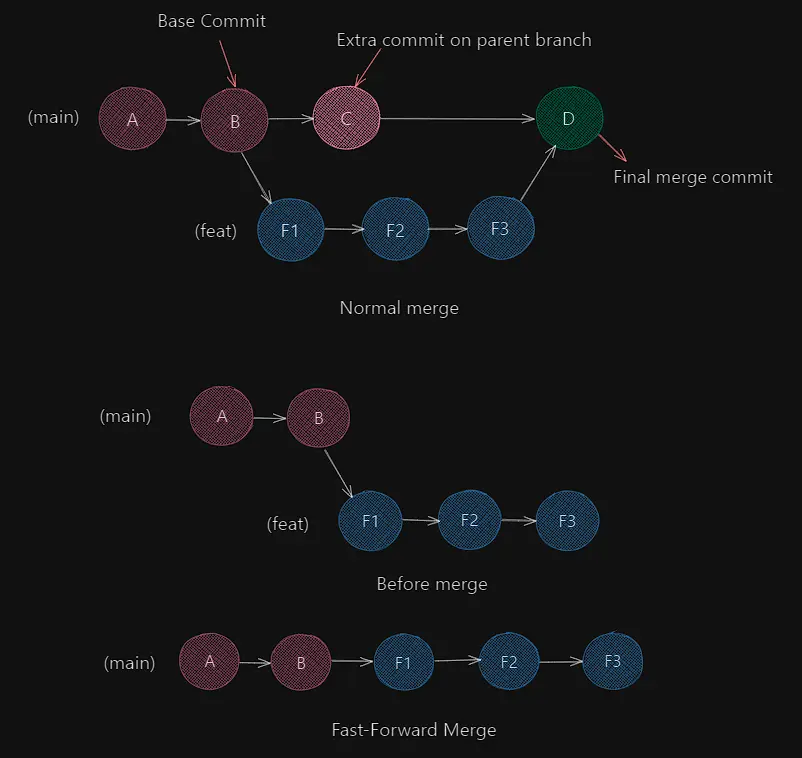
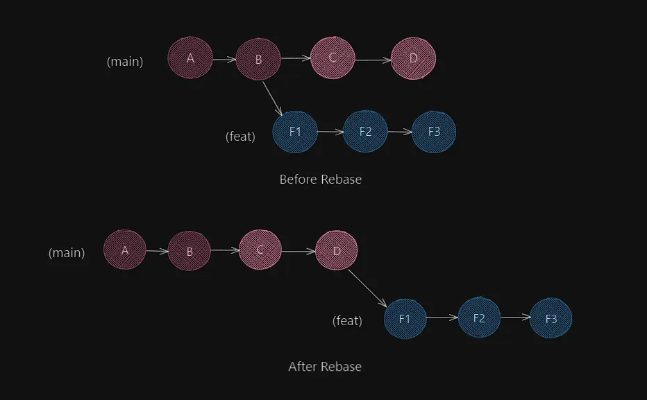

No matter where you are in this world, the ghosts of your wrecked-up commit history will hunt you down.
They will shred your commit messages, infiltrate your branches and plunder you of hundreds of lines
of your spaghetti code, not to mention time. The only way you get to combat those that stand in your way
is to befriend Git. In this article, I will go over the most essential Git concepts and techniques
that I've picked up during the last year.

As always, this is not meant to be an introduction to Git. I assume your familiarity with preliminary Git stuff
like branches and remotes, staging, committing, pushing amongst other basic commands. I will also use the words
parent-branch or main-branch interchangeably.

## Updating Branches

Primarily, developers hover around two philosophies when it comes to updating branches. **_Git Merge_** and
**_Git Rebase_**.
Merge creates a new _merge commit_ that merges all the changes from the feature branch
(the branch you want to merge) into the parent branch (the branch you are on) in a single
commit on the parent branch, whereas rebasing is the change of the base commit of a branch.

Merging combines histories while rebasing rewrites histories.

#### Git Merge

A Fast-Forward merge (FF-merge) occurs when the parent branch has not diverged from the feature branch, in other
words, it does not contain new commits since the base commit (parent commit) of the feature branch.
Conventionally, a normal merge commit is created when both the parent branch and the feature branch have diverged.



Usually, we do not need to bother ourselves with the choice of merges since Git automatically defaults to FF-merge
whenever possible or a normal merge otherwise. But for specific situations, we have various flags at our
disposal to suit our needs.

- `--no-ff` to enforce a merge commit even when fast-forward is possible

- `--ff-only` to ensure a fast-forward merge only or abort otherwise

- `--abort` to abort a merge, usually during merge conflicts

When working with remote branches, there are two commonly used methods for merging. Using `git pull`,
which fetches and applies the changes from the remote to our workspace,

```
(on: main) # merging remote feature branch

git pull <remote> <feature-branch>
```

or using `git fetch`, which only fetches the latest changes present in the remote.

```
(on: main) #merging remote feature branch

git fetch <remote> <feature-branch>

git merge <remote>/<feature-branch>
```

> It is a good practice to merge the main branch to our feature branch before we push our branch to the remote.
> This helps avoid merge conflicts.

#### Git Rebase

Rebasing is deceptively simple to understand, but has a greater proclivity to cause issues in the long run.
As I briefly mentioned at the start of this section, Rebase essentially re-writes history. Rebasing our feature
branch changes its base commit to the latest commit on the parent branch, thus updating
it with fresh commits from its parent branch and creating a linear timeline that's easy to understand.
The latter is one of the biggest benefits of rebasing. Merging multiple branches without rebasing can create
a messy and convoluted commit graph.

```
(on: feat)
git rebase main
```



Now, this might look a bit similar to a fast-forward (FF) merge, but it is not. In a rebase, we relocate the
base commit of our feature branch to the tip (latest commit) of our main branch. The main branch is not
affected by this action. However, in a fast-forward merge, we merge commits from a feature branch into the
main branch, which leads to the main branch incorporating the commits made in the feature branch.
The only common aspect between the two is the apparent "linearity" established by them, but do not be deceived
by that!

I generally avoid rebasing branches that have a long series of commits unique from their parent branch. This
is because the process of rebasing creates n merge conflicts corresponding to the n unique commits that are
present in the feature branch, leading to multiple conflicts that must be handled individually before the
rebasing can be completed. For instance, in the diagram above, we have 3 unique commits on our feature branch.
Rebasing would involve creating new commits for each of the three commits.

```
(on: feat)
git rebase main

(rebasing: 1/3) # resolve first merge conflict associated with commit F1

git add .
git commit -m <new-commit-message>

git rebase --continue

(rebasing: 2/3) # resolve second merge conflict associated with commit F2

# commit the changes and continue rebase

(rebasing: 3/3) # resolve last merge conflict associated with commit F3

# commit the changes and continue rebase to complete the process

```

Evidently, the higher number of unique commits, the greater the hassle. But please note that **_merge conflicts
only arise when there are discrepancies between two versions of the same file_**. If the main branch does not have
any commits that have modified the file the commits in your feature branch have, there will be no
merge conflicts! You can always abort rebase using
the `--abort` flag or `--skip` to skip a commit if you find yourself in a tangle.

A crucial feature about rebasing that is often overlooked is that commit hashes change
when a branch is rebased. This is because rebasing, like we discussed, re-writes history. Since the base commit
changes, it also influences the change in the hashes of individual commits.

> We should refrain from rebasing branches whose commits have already been pushed remotely. As commit
> hashes change when rebasing, it causes issues for other developers you're collaborating with.

## Editing with Interactive Rebase

`git rebase --interactive` was something I regretted not knowing sooner. It is an
extremely versatile and powerful tool that builds on top of normal rebase and enables us to modify our
commit tree.

```
git rebase -i <commit-hash>
```

The commit-hash is important to capture the range of commits we want to perform the rebase against. This will
become clear shortly.

#### Squashing

Quashing commits together is sometimes helpful to delete redundant commit messages and clean up the timeline.
We can have a less verbose look at our a commit history using `git log --oneline`, which does away with
information like date/time of commit and author.

```
8adcc0a commit4
09949cc commit3
9cc7ad0 commit2
dfdf79f commit1
```

If we pull a `git rebase -i dfdf79f` on this, an editor instance will spin up. It could be the default editor
in your terminal, like Vim in my case, or simply a tab in your code-editor. It will look something like this

```
pick 9cc7ad0 commit2
pick 09949cc commit3
pick 8adcc0a commit4
```

The commits after the commit associated with ID `dfdf79f` (in this case, the first commit) are chosen and
sorted in their order of occurrence, with the latest commit being at the bottom.

All commits are set to `pick` as the default action for rebase.
To squash commits 2 and 3 together into a single commit, we can change the `pick` to `squash`
(or simply `s` for shorthand) against commit3. After we save and exit the editor, another instance of the editor
will pop up, asking us to write the commit message for the newly squashed commit. And after finally having done
so, the rebase will complete successfully. Every action that is carried out in Interactive Rebase is followed
by these last few steps that's automatically managed by Git and the editor.

Note that the commit(s) with `s` gets squashed against the
last preceding commit which does not have a `squash` action against it. For example,

```
pick fg2l55e commit1
pick 9cc7ad0 commit2
s 09949cc commit3
s 8adcc0a commit4
pick a880x5c commit5

```

Commits 3 and 4 get squashed with commit 2.

```
(on: main)
git log --oneline

a880x5c commit5
4rt7jff squashed-commit-yay
fg2l55e commit1
```

#### Edit, Reword and Drop

Edit is used for editing the contents of a commit during rebase. This will instruct Git to pause when it reaches the
specified commit to allow the user to modify the workspace along with the commit message. By default, the `pick`
action (or normal rebase) does not stop at every commit unless there is a merge conflict, in which case,
we can compare the changes and modify the commit message. But `edit` (`e` for shorthand) gives us the
opportunity to inspect a commit regardless of a conflict. After making the changes, we must use

```
git add .
git commit --amend ## This will spin up a commit-message instance
git rebase --continue
```

to continue with the rebase.

Reword allows us to modify a commit message. This can be done by replacing `pick` with
`reword` or `r` (for shorthand) and saving the changes. Like before, this will prompt a new instance to edit
the commit message.

`drop` (`d` for shorthand) simply discards a commit from the timeline and reapplies the changes from the remaining
commits.

```
r fg2l55e commit1 # edit the commit message
e 4rt7jff squashed-commit-yay # edit the commit itself
d a880x5c commit5 # drops the commit
```

## Stashing

I find stashing incredibly helpful. We often make changes that we do not necessarily want to commit yet. But Git
also does not allow us to switch to a new branch if unstaged changes are present in the current working branch.
Stashing allows us to store these unstaged changes separately and then continue working on something else, while
always having the option to re-apply our previously stashed changes to the current workspace.

```
git stash
```

- `git stash list` - Displays a list of all stashes. (You can have multiple stashes) It
  is usually followed by the index `stash@{number}`. The latest stash has the index of 0.

- `git stash apply <stash-index>` - Applies the specified stash to the workspace. If the index is not
  specified, the latest stash is applied.

- `git stash pop <stash-index>` - Works similarly to apply except that it removes the stash from the
  stash list.

- `git stash drop <stash-index>` - Deletes the specified stash

- `git stash clear` - Deletes all stashes

## Detached Head

A detached head state occurs when the `HEAD` of a branch is not pointing directly to any branch but rather
a specific commit. As you might have already known, the `HEAD` pointer normally points to the latest commit
of a branch but in a detached state, it isolates and points to a commit. This can be achieved by checking out
the commit using its commit hash.

```
git checkout <commit-hash>
```

On a detached state, any changes made to the workspace is not registered in any branch since there are no
branch labels associated with the commit. Instead, the changes can be committed and then accessed later by saving
them in a new branch.

```
git add .
git commit -m <commit-message>
git checkout -b <new-branch>
```

Detached states are useful for experimentation without affecting any branch.

## Undo-ing

We're all bound to mess up Git at some point. This is why we have several methods to redeem ourselves from ghastly
errors and go back to a safe state. In this section, we'll discuss the most common methods to retrace
to previous commits.

> Before we start retracing our paths, we need to have a clear picture of the modifications that are prevailing in
> the current workspace. The `git diff` command is my favourite way to compare the changes in the current
> workspace against the previous commit
> state.

#### Git Reset

Reset comes in two flavours. `--soft` and `--hard`. Using `--soft` keeps file changes (both staged or unstaged)
in the workspace but
moves the `HEAD` pointer to a previous commit. We must use a commit-hash or the `HEAD` syntax to reset to a
particular commit. For example, `--soft HEAD~2` will take the pointer to the last
but second commit. Whereas, `--hard HEAD~2` will reset the workspace to that commit along with the
`HEAD`. The `HEAD~n` and `<commit-hash>` syntax can be used in place of the other.

`--soft` is often used to "delete" commit messages and create new ones without altering the workspace.

```
git reset --soft <HEAD~n> #n - number of previous commits to switch back to
git reset --hard <commit-hash> #n - number of previous commits to switch back to
```

#### Git Revert

Revert creates a new commit which undos the changes brought upon by a previous commit. It does not remove the
commit from the timeline but instead discards its changes from the workspace. We always have the choice of
reverting back to the original state later.

How does `revert` and `reset --hard` work differently? A simple answer would be that `reset` does not leave
room for merge conflicts. It simply undos all current changes and transports the workspace back to a previous commit.
Hence it is pretty straightforward. But `revert` allows us to consider and compare both current and previous
states when possible merge conflicts occur. The same flags from rebase can be used to complete the reversion
accordingly.

Another significant variation between the two is how they reflect the changes to when resetting back to a commit.
Let's take an example.

```
(on: main)
git log --oneline

8adcc0a (HEAD -> main) commit4
09949cc commit3
9cc7ad0 commit2
dfdf79f commit1

```

If we enter

```
git reset --hard 9cc7ad0
```

the workspace (and HEAD pointer) will be brought back to the state _after_ the second commit, which is commit2.

But

```
git revert 9cc7ad0
```

will revert the workspace back to the state that was present _before_ the second commit (commit2) was made.
Effectively, putting us back after the first commit was created. A major advantage of `revert` is the
flexibility it provides regarding modification of files and the preservation of commits.

#### Git Restore

Restore restores the state of a file to the state of its last commit. You can also unstage a file using the flag
`--staged`.

```
git restore <file>
```

#### Undoing Rebase

One of the major downsides to rebasing is undo-ing a rebase. Although, it is not
encouraged to undo rebases as it makes matters more complicated for people working on the same or adjoining
branches, it is not impossible. Since rebasing changes commit hashes and re-writes history, it is often a problem when old commits are
referenced.

We can use `git reflog <feat-branch>` to get the branch's timeline with rebase or reset operations.
To revert back to the state before the rebase, we can copy the hash of the commit before the commit with
the `rebase (finish)` message and perform a hard reset.

## Conclusion

Git is arguably the most indispensable tool for any developer. Whether you're an open-source maintainer,
a do-gooder hobbyist, or a rebel like me trying to escape the clutches of corporate tech,
I hope this helps you feel more comfortable about tackling large codebases. Now go teach someone a thing or two
about getting good at Git!

<div style="display: flex; justify-content: flex-end; color: #c4c1b9">
  <p
    style="font-style: italic; margin-top: 10rem; width: 50%"
    class="foot-text"
  >
    {" "}
    Finished in my dorm room (6008), realising that the hurdle of adapting to the
    environment is assuaged by a supply of good toilet paper.
  </p>
</div>
