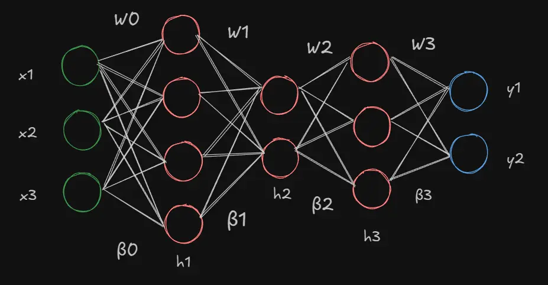
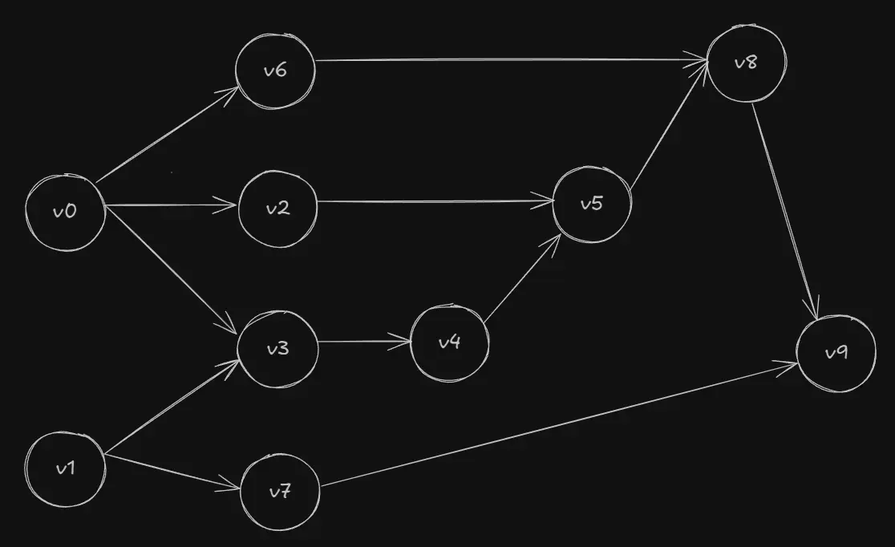

Computers need to calculate derivatives using algorithms that are rightfully "computer-like" and
differ from the common methods used by humans. This technique, known as automatic differentiation,
is a general formulation that has been used in a number of domains such as finance, computational fluid
dynamics, control systems and engineering design. Even though it finds its use wherever
scientific computing is done, we will be studying from the realm of machine learning.

### Necessary primer

For a disclaimer, this article is not aimed to teach you neural networks or optimization algorithms
but rather how gradients are calculated efficiently in computers and why it makes a difference
in the _context_ of neural networks. This section is for those who have no clue what neural
networks are or how they are trained. Feel free to skip to the next section.

A neural network, in brutally simple terms, is a mathematical model that learns patterns
from data and helps us make predictions or useful insights on new, unseen data.
We start with describing a kind of neural network known as the _multi-layer-perceptron_.
The network takes in a set of inputs ($$ x_i $$) which it feeds into a number of layers and finally gives
us an (or many) output(s) ($$ \hat{y_i} $$). Each of these layers contains a number of hidden units
(neurons) that each takes in input from the neurons of the previous layer, performs an operation on
this input and passes it to the neurons of the next layer. When each neuron of a layer is connected to
all neurons in its preceding and succeeding layer, we call it a _fully connected network_.



We can define the network as a function $$ f(x, \phi) $$, where $$ x $$ represents the
inputs to the network while $$ \phi $$ represents the set of parameters of the model (weights and biases).
At every neuron, we carry out three simple operations.

1. Multiply the incoming input with the weight specific to that input. ($$ wx $$)
2. Add a bias to this term. ($$ wx + \beta $$) This result is called the pre-activation.
3. We finally take this linear term and feed it into a non-linear function ($$ \tanh $$, sigmoid or ReLU)
   known as an activation function ($$ a[wx + \beta] $$).
   These functions allow the model to capture the non-linearity present in the data.

If there are $$ n $$ neurons in the previous layer of a fully connected network, a neuron in our
current layer gets $$ n $$ inputs and thus $$ n $$ weights for each with one bias term for the
entire neuron. An individual neuron's output (activation) would look like this.

$$

output = a[\sum_{i = 1}^{n}{w_ix_i + \beta}]


$$

Now consider the combined output of all neurons in the first layer.
If we have an input vector $$ x \in \reals^n $$, $$ m $$ neurons, a weight matrix 
$$ w_0 \in \reals^{m \times n} $$ with each row representing the weights of one neuron,
a bias vector $$ \beta_0 \in \reals^m $$, then we can represent the output of the layers as

$$

h_1 = a[w_0x + \beta_0] \\
\quad \\
h_{k+1} = a[w_{k}h_k + \beta_{k}] \\


$$

with the final output (after the last layer) having
no activation $$ f(x, \phi) = w_kh_k + \beta_k $$. As you can notice, each layer takes in the output
of the previous layer as its input (function composition). This is why the set of 
weights and biases together are called the parameters or learnable components of the 
neural network ($$ \phi $$) as changing any one value would invariably change the output of the model.

We can measure whether a model is learning well by matching its predictions against the
"actual truth". The "actual truth" is the real result ($$ y_i $$) corresponding to the
input data ($$ x_i $$). The distance to this is estimated
by a metric known as the "Loss", which is the difference between the actual value and
the predicted output of the model $$ (\hat{y_i} = f(x, \phi)) $$. A high loss indicates a large discrepancy
between the model's output and the real value while a loss of near zero means the model's predictions are very accurate.

The simplest of loss functions is the Mean Squared Error. It is the average of the
squared differences between actual values and predicted values.

$$

L(\phi) = \frac{1}{n}\sum_{i = 1}^{n}(y_i - \hat{y_i})^2


$$

Our primary objective is to minimize this loss function. The loss function space over parameters
(scalar field) can be imagined as a valley with hills, slopes and ravines like a real landscape with several
perturbations on the surface of the terrain. We need to choose parameters that take our model's loss to the lowest point
of this terrain (a global minima). There have been several algorithms that attempt to learn
or "uncover" these parameters but the most practical and universally used algorithm in today's era
is a technique called Gradient Descent.
Starting at any point on the surface (taken care of by proper initialization methods),
we interatively calculate the slope of the loss function or formally the gradient,
which is the vector of partial derivatives with respect to each weight and bias
on that point. This involves calculating the gradient of the loss
$$ l_i $$ representing the loss for the $$i$$-th sample $$ (f(x_i, \phi) - y_i)^2 $$

$$
\frac{\partial l_i}{\partial w_k}, \quad \frac{\partial l_i}{\partial \beta_k}
$$

for every layer and every training sample.

The gradient vector tells us how much the loss would change if we nudged that specific parameter
slightly. It points in the direction of steepest increase in the loss. Since we need to minimize
the loss, we update the parameter vector by multiplying the gradient vector with a scalar known as
the learning rate ($$ \alpha $$) and then subtracting it from our current parameter vector. This is how we "descend" down
the slope and keep tweaking our model's parameters on every iteration to improve results.

$$

\phi_{t + 1} = \phi_t - \alpha \sdot \sum{\frac{\partial l_i(\phi_t)}{\partial \phi_t}}


$$

With all of this in our mind, we can now focus on what this article is really about.
Calculating those gradients!

### Finite differences and symbolic differentiation

The definition of a typical derivative of a univariate function $$ y = f(x) $$ that we learn in our
calculus classes is as follows.

$$

\frac{dy}{dx} = \lim_{h \to 0} \frac{f(x + h ) - f(x)}{h} \quad \quad - (1)


$$

This equation, known as finite differences, tells us just how fast (the rate) the function changes instantaneously
at a certain point. It is equivalent to the slope of the tangent ($$ \tan\theta $$)
at that point as the numerator represents the change in the value of the function (perpendicular)
and the denominator $$ h $$ is the infinitesimal increase in $$ x $$ (base).

For the case of gradient descent, we can represent the derivative of the loss function
with respect to a parameter ($$ \theta_i $$) like so.

$$

\frac{\partial{L}}{\partial{\theta_i}} = \lim_{h \to 0} \frac{L(\theta_i + h \sdot e_i) - L(\theta_i)}{h}


$$

where $$ e_i $$ is the $$i$$-th unit vector (vector where the $$i$$-th element is $$ 1 $$ and the
rest $$ 0 $$). We include it for maintaining an important mathematical consistency but will
ignore this for the remainder of the section.

The primary issue in finite differences comes from the rise of two kinds of errors, namely truncation
and rounding, both of which are represented as functions $$ O(h) $$. 
Because computers cannot really tend $$ h $$ to $$ 0 $$ like we formally would in theory, we are
forced to assign a tiny but finite value for h and can only approximate the
true mathematical derivative by taking the taylor series expansion. The former of the two errors is directly due to the
extra terms present in the expansion of $$ l(\theta_i + h) $$.

$$

L(\theta_i + h ) = L(\theta_i) + h \sdot L'(\theta_i) + h^2 \sdot
\frac{L''(\theta_i)}{2!} + \sdot h^3 \sdot \frac{L'''(\theta_i)}{3!} + \dots


$$

If we substitute this into $$ (1) $$, we get

$$

\frac{L(\theta_i + h) - L(\theta_i)}{h} \approx L'(\theta_i) + h \sdot \frac{L''(\theta_i)}{2!}
+ h^2 \sdot \frac{L'''(\theta_i)}{3!} + \dots


$$

As we are only interested in the first derivative, the terms
following $$ l'(\theta_i) $$ contribute to the error.
We can mitigate this truncation error by taking the central difference $$ f(x + h) - f(x - h) $$ in place
of a forward ($$ f(x + h) - f(x) $$) or backward difference ($$ f(x) - f(x - h) $$).

$$

l(\theta_i + h ) = l(\theta_i) + h \sdot l'(\theta_i) + h^2 \sdot
\frac{l''(\theta_i)}{2!} + \sdot h^3 \sdot \frac{l'''(\theta_i)}{3!} + \dots

\\
\quad
\\

l(\theta_i - h ) = l(\theta_i) - h \sdot l'(\theta_i) + h^2 \sdot
\frac{l''(\theta_i)}{2!} - \sdot h^3 \sdot \frac{l'''(\theta_i)}{3!} + \dots

\\
\quad
\\
\quad
\\

\frac{l(\theta_i + h) - l(\theta_i - h)}{2h} \approx l'(\theta_i) + h^2 \sdot \frac{l'''(\theta_i)}{3!}
+ \dots


$$

Since half the terms cancel out, the truncation error in this case will be much lesser.

Taking a larger value of h will fail to approximate the derivative well and lead to an
increase in the truncation error. If we decrease the
value of $$ h $$, the truncation error decreases but in turn, increases the rounding error.

The rounding error arises from the infamous inability of computers to handle floating point arithmetic.
As we shrink $$ h $$ to an extremely small value, subtracting $$ f(x + h) $$ and $$ f(x) $$,
which almost become indentical values often results in computer programs (typically handle
double-precision floating point numbers but is dependent on compiler and
machine specifications) rounding off to zero and a complete loss of information. The smaller the value
of $$ h $$, the higher the numerical instability.

The direct and inverse relationship of the truncation error and rounding error respectively
with $$ h $$ leads us to a trade-off where we must find the
optimum value of $$ h $$ to get the most out of the derivatives.

Additionally, for a function $$ f: \reals^m \to \reals^n $$, the time complexity to compute the gradients 
is roughly $$ O(m \times n) $$, which is quite inefficent
if we take into account that neural networks can contain billions of parameters and would
blow up the computation time massively. And all of these
inaccuracies exacerbate in the case of higher (2nd or more) derivatives.

To address these problems, we turn to a second approach known as symbolic differentiation. In reality,
this isn't much different from how we handle differentiation algebraically. Consider the functions,

$$ f(x) = e^xcos(x) + 3x^2; \quad g(x) = 4x\ln(x) $$

We can differentiate a function $$ f(g(x)) $$ using the chain-rule by writing a program
to rearrange terms according to the rules of calculus. But neural networks have hundreds of layers
that result in functions that are composed of hundreds of other functions. While we don't have to
deal with precision errors, unwrapping all of these compositions using the chain-rule would again, blow up the number of terms and compute required (known as
expression swell). It would also require implementing a caching system to avoid redundant
calculations and increase complexity.  
And needless to say, the performance for higher-order derivatives would be terrible.

Software like Wolfram-Alpha uses symbolic differentiation for its operations but applies
various simplification functions after each operation recursively.
This includes factorization or cancelling terms to reduce
expressions to compact "nice" forms. But such measures are mostly heuristical
and often slow since they try many strategies and provide no guarantee of finding
simple forms, if "simple" is even something well-defined in the first place.
Clearly, this is not feasible for machine learning.

This is where we take a step back and start thinking programmatically.

### Automatic Differentiation

Consider a function $$ f(x, y) = x^2cos(2xy) + e^x - 4y $$. We can express it as the sum  
of three smaller expressions $$ v_1 = x^2cos(2xy) $$, $$  v_2 = e^x $$ and $$ v_3 = -4y$$.
Such decomposition into intermediate values (called primals) is exactly what
automatic differentiation is about.

Autodiff constructs a computational graph (Directed Acyclic Graph) of these primals
to track how each value depends on the next. The nodes comprise
of input, output and all intermediate variables while the edges of the graph maintain the flow or
direction of computation.

We can examine this by creating an evaluation trace, which is a record that keeps track of the
primals at each primitive operation. It starts by building the expression from its scalar
inputs and combining them to form larger expressions using simple binary operators
$$ (+, -, \times, \div) $$ or transcendental functions like $$ \sin(x) $$ and $$ \ln(x) $$.

For the function $$ f(x, y) $$, let the value of $$ x $$ and $$ y $$ be $$ 0.5 $$ and $$ 1.5 $$
respectively. Then its evaluation trace would be as follows.

$$

v_0 \rightarrow  x = 0.5 \\
\quad
\\
v_1 \rightarrow  y = 1.5 \\
\quad
\\
v_2 \rightarrow  v_0^2 = (0.5)^2 = 0.25 \\
\quad
\\
v_3 \rightarrow  2v_0v_1 = 2(0.5)(1.5) = 1.5 \\
\quad
\\
v_4 \rightarrow  cos(v_3)  = cos(1.5) = 0.07 \\
\quad
\\
v_5 \rightarrow  v_2v_4 = 0.25 \times 0.07 = 0.0175 \\
\quad
\\
v_6 \rightarrow  e^{v_0} = e^{0.5} = 1.6487 \\
\quad
\\
v_7 \rightarrow  4v_1 = 4 \times 1.5 = 6 \\
\quad
\\
v_8 \rightarrow  v_5 + v_6 = 0.0175 + 1.6487 = 1.6662 \\
\quad
\\
v_9 \rightarrow  v_8 - v_7 = 1.6662 - 6 = -4.33 \\


$$



#### Forward Mode and Dual Numbers

In forward mode, we calculate the primal and its derivative (also called the tangent)
at every node in the computational graph. These tangents represent the
partial derivative of a primal with respect to a specific input variable (say $$ x $$).
As we move through the graph, we apply the chain rule to propagate these derivatives,
ultimately arriving at the derivative of the entire function with respect to the chosen input.

By performing a forward pass on $$ z = f(x, y) $$ with respect to $$ x $$, we get the following
tangent trace.

$$

v_0 = 0.5, \rightarrow v_0' = x' = 1 \\
\quad \\
v_1 = 1.5 \rightarrow v_1' = y' = 0 \\
\quad \\
v_2 = 0.25 \rightarrow v_2' = 2v_0 \sdot v_0' = 1  \\
\quad \\
v_3 = 1.5 \rightarrow v_3' = 2(v_0'v_1 + v_0v_1') = 3 \\
\quad \\
v_4 = 0.07 \rightarrow v_4' = -sin(v_3)v_3' = -0.99 \times 3 = -2.99 \\
\quad \\
v_5 = 0.0175 \rightarrow v_5' = v_2'v_4 + v_2v_4' = 1 \times 0.07 + 0.25 \times -2.99 = -0.677 \\
\quad \\
v_6 = 1.6487 \rightarrow v_6' = e^{v_0}v_0' = 1.6487 \\
\quad \\
v_7 = 6 \rightarrow v_7' = v_1v_1' = 0 \\
\quad \\
v_8 = 1.6662 \rightarrow v_5' + v_6' = -0.677 + 1.6487 = 0.971 \\
\quad \\
v_9 = -4.33 \rightarrow v_8' - v_7' = 0.971 - 0 = 0.971 \\


$$

The dependency properties of DAG assures us that any derivative needed to calculate the current
primal's derivative has already been calculated at a previous node. Thus, the tangent of the
final value $$ v_9 $$ is equal to the partial derivative of the whole function with respect
to $$ x $$ at ($$ 0.5, 1.5 $$).

This leads us to an important advantage of AD over symbolic differentiation. We saw through
the evaluation trace that AD computes the values dynamically during runtime by traversing
the graph. It does not really care how the computation is performed. It only records what values
went into each operation, their outputs and the chain of operations. This means that we could write code that
involves conditional branching, looping and recursions as long as they involve
a sequence of mathematical operations and produce numerical values. Essentially, this makes AD
"blind" to control flow logic as it is only concerned with the values that result from the
execution of a branch regardless of the path taken. Symbolic differentiation would struggle in such
cases as it would start finding a single expression to handle all branching cases and would
inevitably introduce non-differentiable points. This makes AD incredibly powerful for a vast
number of applications.

The idea of forward mode AD is reflected in the analytical method called Dual Numbers.
A dual number is defined as $$ a + b\epsilon $$ where $$ \epsilon^2 = 0, \epsilon \neq 0 $$, with $$ a $$ and $$ \epsilon $$
being the real and dual parts respectively. The coefficient of $$ \epsilon $$ can also be denoted
as $$ a' $$ as it carries the derivative. Assuming the $$ \epsilon^2 = 0 $$ is necessary because when we plug a dual
number into the taylor series, all the terms containing $$ \epsilon^2 $$ or higher powers should vanish, leaving us with
only $$ f(x) + f'(x)\epsilon $$. This can also be demonstrated by multiplying two dual numbers.

$$

(x + x'\epsilon)(y + y'\epsilon) = xy + x'y'\epsilon^2 + \epsilon(xy' + x'y) = xy + \epsilon(xy' + x'y)


$$

The $$ xy $$ term is merely the product of the real parts (primal) while the coefficient of $$ \epsilon $$ is
nothing but the primal's derivative (tangent).

Let's take the example of a function $$ f(x, y) = 3x^2 - 4xy^2 $$.
To evaluate the derivative at the point (1, 2), we consider consider 
$$ x = 1 + 1\epsilon_x + 0\epsilon_y $$ and $$ y = 2 + 0\epsilon_x + 1\epsilon_y $$. Substituting
these into the function, we get

$$

f'(1, 2) = 3(1 + \epsilon_x)^2 - 4(1 + \epsilon_x)(2 + \epsilon_y)^2 \\
\quad \\
= 3 + 3\epsilon_x^2 + 6\epsilon_x - 4(4 + \epsilon_y^2 + 4\epsilon_y + 4\epsilon_x + \epsilon_x\epsilon_y^2 + 4\epsilon_x\epsilon_y) \\
\quad \\
= -13 - 10\epsilon_x - 16\epsilon_y - 16\epsilon_x\epsilon_y
$$

This tells us that the value of the function at ($$ 1, 2 $$) is $$ -13 $$, derivative with 
respect to $$ x $$ is $$-10 $$, derivative with respect to $$ y $$ is $$ -16 $$ and the
mixed second-order partial derivative $$ \frac{\partial^2 f}{\partial x \partial y} $$ is $$ -16 $$.

For a function $$ f: \reals^n \to \reals^m $$ that can represent a neural network with
$$ n $$ inputs and $$ m $$ outputs, we can consider a matrix that contains the
partial derivatives of all outputs $$ y_i $$ with respect to each input $$ x_i $$. This matrix
of size $$ (m \times n) $$ is known as the Jacobian ($$ J $$).

$$

J_f =
\begin{bmatrix}
\frac{\partial y_1}{\partial x_1} & \dots & \frac{\partial y_1}{\partial x_n} \\
\vdots & \ddots & \vdots
\quad \\
\frac{\partial y_m}{\partial x_1} & \dots & \frac{\partial y_m}{\partial x_n}
\end{bmatrix}


$$

It tells us how each input influences an output or how sensitive an output is to change
in a particular input. In forward-mode AD, each run computes the derivative of all outputs
with respect to one particular input. Therefore, the $$j$$-th column of the Jacobian
represents a single forward pass associated with the input $$x_j$$ and each $$i$$-th
row corresponds to the gradient of one output $$ y_i $$ with respect to all inputs.

$$

J_{(i, j)} = \frac{\partial y_i}{\partial x_j}


$$

As every forward pass builds one column of the Jacobian, it takes $$ O(n) $$
time to build the entire matrix. So if we need to get the directional derivative (rate at which 
the function changes in a given direction at a particular point, basically the projection of the gradient
along $$ v $$) of the function with respect to
a vector $$ v, v \in \reals^n $$ (known as seed tangent vector), we would
need to calculate the Jacobian of the function and multiply it with the given vector.

$$

\nabla f(x, y) \sdot v = J_f \sdot v


$$

As we concluded earlier, doing this naively would be quite inefficient. This is exactly
what forward mode AD helps us avoid. It calculates the Jacobian-Vector-Product ($$ J_f v $$) at the cost of a single forward pass
without ever needing to calculate the full Jacobian matrix, which would require $$ n - 1 $$ extra
passes.

The JVP is a column vector (in our case) with $$ m $$ rows (matrix product of $$ m \times n $$ and $$ n \times 1 $$). 
For a function $$ f: \reals^n \rightarrow \reals $$ like a loss function, the JVP is a scalar.
It contains information on how the outputs change when the inputs are pushed along
the direction of $$ v $$. In short, each component is the directional derivative of an output 
$$ f_i(x) $$ along $$ v $$. Furthermore, if we choose the seed tangent vector to be
the $$j$$-th unit vector, we get the $$j$$-th column of the Jacobian that contains the gradients with respect
to input $$ x_j $$. But if we choose a general vector in space, we
get a linear combination of columns of the Jacobian. In our example of the evaluation trace, 
we chose to calculate the partial derivatives with respect to a single input $$ x $$, which
aligns with the unit seed tangent vector.

To implement Jacobians in the evaluation trace, we chain the local Jacobians calculated
at each primitive as we traverse the graph. A local Jacobian ($$ J_{f_k} $$) is the matrix
containing the partial derivatives of the local outputs with respect to each local input. The 
local tangent ($$ t_k $$) is the product of this local Jacobian with the 
incoming tangent vector $$ t_{k - 1} $$. Simply put, it is the directional derivative 
of the primal when applied in the direction of $$ t_{k - 1} $$.

$$
t_k = J_{f_k} \sdot t_{k - 1}
$$

Mathematically, the JVP is the product of the local Jacobians in the direction of v.
If $$ f $$ is a composition of many functions $$ f_k $$,

$$

f = f_k(f_{k-1}(\dots f_1)) \\
\quad \\
J_f v = (J_{f_k} \sdot J_{f_{k-1}} \dots J_{f_1}) v


$$

Since matrix multiplication is associative, AD is equivalent to performing the multiplications
step-wise.

$$

J_f v = J_{f_k}v \rightarrow J_{f_{k-1}}v \rightarrow \dots \rightarrow J_{f_1}v


$$

To summarize, we start with the seed tangent vector $$ t_0 = v $$, propagate the tangent vector
at each primitive operation and finally end up with the final tangent $$ t_k = J_f v $$ which
is our JVP.

If we consider a function $$ f(x, y) = sin(xy + x) + e^{2y} $$, we can calculate its JVP 
in the direction of the tangent vector $$ v = \begin{bmatrix} 1 \\ 2 \end{bmatrix} $$
in one single pass as follows.

$$

v_0 = x \rightarrow v_0' = 1 \\
\quad \\
v_1 = y \rightarrow v_1' = 2 \\
\quad \\
v_2 = v_0v_1 \rightarrow J_{v_2} = \begin{bmatrix} v_1 & v_0 \end{bmatrix},
v = \begin{bmatrix} v_0' \\ v_1' \end{bmatrix} = \begin{bmatrix} 1 \\ 2 \end{bmatrix} \rightarrow v_2' = J_{v_2} \sdot v = y + 2x \\
\quad \\
v_3 = 2v_1 \rightarrow J_{v_3} = \begin{bmatrix} 2 \end{bmatrix},
v = \begin{bmatrix} v_1' \end{bmatrix} = \begin{bmatrix} 2 \end{bmatrix} \rightarrow v_3' = J_{v_3} \sdot v = 2\sdot2 = 4 \\
\quad \\
v_4 = v_2 + v_0 \rightarrow J_{v_4} = \begin{bmatrix} 1 & 1 \end{bmatrix},
v = \begin{bmatrix} v_2' \\ v_0' \end{bmatrix} = \begin{bmatrix} y + 2x \\ 1 \end{bmatrix} \rightarrow v_4' = J_{v_4} \sdot v = y + 2x + 1 \\
\quad \\
v_5 = sin(v_4) \rightarrow J_{v_4} = \begin{bmatrix} cos(v_4) \end{bmatrix},
v = \begin{bmatrix} v_4' \end{bmatrix} = \begin{bmatrix} y + 2x + 1 \end{bmatrix} \rightarrow v_5' = J_{v_5} \sdot v = cos(v_4)(y + 2x + 1) \\
\quad \\
v_6 = e^{v_3} \rightarrow J_{v_6} = \begin{bmatrix} e^{v_3} \end{bmatrix},
v = \begin{bmatrix} v_3' \end{bmatrix} = \begin{bmatrix} 4 \end{bmatrix} \rightarrow v_6' = J_{v_6} \sdot v = 4e^{v_3} \\
\quad \\
v_7 = v_5 + v_6 \rightarrow J_{v_6} = \begin{bmatrix} 1 & 1 \end{bmatrix},
v = \begin{bmatrix} v_5' \\ v_6' \end{bmatrix} = \begin{bmatrix} cos(xy + x)(y + 2x + 1) \\ 4e^{2y} \end{bmatrix} \rightarrow v_7' = J_{v_7} \sdot v = cos(xy + x)(y + 2x + 1) + 4e^{2y}\\


$$

The value of final tangent ($$ v_7' $$) at ($$ 0.5, 2 $$) is equal to

$$
J_{f}(0.5, 2) \sdot v = cos(0.5\sdot2 + 0.5)(2 + 2\sdot0.5 + 1) + 4e^{2\sdot2} = 218.67555


$$

In practice, AD should compute and carry the primal calculations during the forward pass, producing
values at each step. But for a better demonstration of the trace,
I instead substituted the values in the final expression. This is mathematically consistent.

Forward mode AD does not suffer from numerical instability issues related with the traditional
differentiation techniques and is usually preferred when the number of inputs is far smaller
than the number of outputs ($$ n << m $$). For example, a function
$$ f: \reals \rightarrow \reals^m $$ would only require one forward pass to obtain the Jacobian. But
for neural networks that contain billions of parameters (inputs) and only a small range of
outputs (usually just $$ 1 $$), we are dealing with the opposite. Enter Reverse Mode AD.

#### Reverse Mode

Reverse Mode AD is famously known as backpropagation, an algorithm developed in the 20th
century that still serves as the backbone of all modern neural networks. Instead
of propagating tangents as in forward mode, we propagate adjoints from the output to the input.
An adjoint represents the accumulated "sensitivity" of the output with respect to a given primal,
computed via the chain rule. So every primal gets paired with an adjoint that tells us how much
the function changes when the primal is changed. For a scalar output function $$ f: \reals^n \rightarrow \reals $$,
adjoints are simply the partial derivatives of the output with respect to each primal.
We will understand this better with an example.

Reverse mode consists of a forward pass and a reverse pass. In the forward pass, we store the
primitive operation (and its dependencies) of each primal to form the computational graph.
If we take our previous function $$ f(x, y) = sin(xy + x) + e^{2y} $$, we would still have the
same $$ 7 $$ primals from our forward pass.

$$

v_0 = x \\
\quad \\
v_1 = y \\
\quad \\
v_2 = v_0v_1 \\
\quad \\
v_3 = 2v_1 \\
\quad \\
v_4 = v_2 + v_0 \\
\quad \\
v_5 = sin(v_4) \\
\quad \\
v_6 = e^{v_3} \\
\quad \\
v_7 = v_5 + v_6


$$

Now let's see what the backward pass would look like. We start from the scalar
output $$ v_7 $$ (taking its derivative to be equal to 1 as $$ \frac{\partial f}{\partial f} = 1 $$) and work our way backwards
using the chain rule.

$$

v_7 = v_5 + v_6 \rightarrow v_5' = \frac{\partial v_7}{\partial v_5} \sdot v_7' = 1 \sdot 1, v_6' = \frac{\partial v_7}{\partial v_6} \sdot v_7' = 1 \sdot 1 \\
\quad \\
v_6 = e^{v_3} \rightarrow v_3' = \frac{\partial v_6}{\partial v_3} \sdot v_6' = e^{v_3} \sdot 1 = e^{v_3} \\
\quad \\
v_5 = sin(v_4) \rightarrow v_4' = \frac{\partial v_5}{\partial v_4} \sdot v_5' = cos(v_4) \sdot 1 = cos(v_4) \\
\quad \\
v_4 = v_2 + v_0 \rightarrow v_2' = \frac{\partial v_4}{\partial v_2} \sdot v_4' = 1 \sdot cos(v_4) = cos(v_4), v_0' = \frac{\partial v_4}{\partial v_0} \sdot v_4' = 1 \sdot cos(v_4) = cos(v_4) \\
\quad \\
v_3 = 2v_1 \rightarrow v_1' = \frac{\partial v_3}{\partial v_1} \sdot v_3' = 2 \sdot e^{v_3}
\quad \\
v_2 = v_0v_1 \rightarrow v_0' = v_0' + \frac{\partial v_2}{\partial v_0} \sdot v_2' = cos(v_4) + v_1 \sdot cos(v_4) = cos(xy + x)(1 + y), v_1' = v_1' + \frac{\partial v_2}{\partial v_1} \sdot v_2' = 2e^{v_3} + v_0 \sdot cos(v_4) = xcos(xy + x) + 2e^{2y}\\

\quad \\
v_0' = \frac{\partial f}{\partial x} = cos(xy + x)(1 + y), \quad v_1' = \frac{\partial f}{\partial y} = xcos(xy + x) + 2e^{2y}\\


$$

At every node (primal $$ z = f(x, y) $$), we accumulate the gradients of the parent primals
by taking the partial derivative of the child value ($$ z $$) with respect to each parent and
multiplying it by the gradient of the child itself, also called the downstream gradient. In this way, 
any input primal that contributed to any output primal gets their gradient updated and 
we eventually reach the last nodes (inputs) to get the derivative of the function with respect 
to these inputs ($$ v_0' $$ and $$ v_1' $$). The accumulation (+=) ensures that we are considering
the gradient of every child if the primal has multiple children. If you look closely at the last step of the evaluation trace, 
we do $$ v_0' = v_0' + \dots $$ and $$ v_1' = v_1' + \dots $$ to update the gradients because
we had already finished calculating the initial gradients of all the $$ 7 $$ primals in
the fifth step itself.

$$

parent.grad += \frac{\partial child}{\partial parent} \sdot child.grad


$$

We know the loss function is a scalar output function $$ f: \reals^n \rightarrow \reals $$. As we
discussed in the first section of this article, our optimization algorithm relies on calculating the gradient
of this loss function with respect to the parameters (inputs).

$$

\frac{\partial L}{\partial \theta}


$$

This can be achieved by multiplying the gradient of the loss taken with respect to
the model's output <br></br> ($$ r^T $$) with the Jacobian of the loss ($$ J_f(\theta) $$), a direct result of
the chain rule. The quantity $$ r^T $$ is sometimes called the error signal and is a 
row vector with dimensions ($$1 \times m$$).

$$

\nabla_\theta L = r^TJ_f(\theta)


$$

This product is a familiar sounding quantity known as the Vector-Jacobian-Product ($$ 1 \times m $$).
Similar to the JVP, reverse mode AD allows us to compute the VJP without the need of a full Jacobian
by propagating the adjoints backwards through the graph. A single reverse pass gives us the
gradients of the loss function with respect to the parameters needed for our gradient descent.
Forward mode AD would require one JVP _per parameter_ to do the same.

$$

\frac{\partial L}{\partial parent} += \frac{\partial child}{\partial parent} \sdot \frac{\partial L}{\partial child}


$$

This is exactly why we say adjoints are the "sensitivities" of the function (loss in our case)
with respect to the primal (input/output/intermediate variables) as $$ r^T $$
is equivalent to $$ \frac{\partial L}{\partial y} $$.

In the code below, we can see what a node in the computation graph looks like when written in
python-like pseudocode.

```
class Node:
  value -> number,
  grad -> number = 0,
  back -> function {},
  parents -> Node[] = []

  constructor(value -> number):
    self.value = value

  // other methods ...

```

Each node has a value (primal), its gradient (or adjoint), a list of its parent nodes and the function
that is responsible for propagating the gradients backwards. Since this backwards function
must be unique for every operation, the node class also contains methods for each supported
operation that describes how the backwards function should behave.

For example, the methods for a multiplication operation, a $$ \log $$ function or a power operation
($$ x^a $$) might look something like this.

```
mul(other -> Node or number):
  if (typeof other is number) other = Node(other)
  out = Node(self.value * other.value) // z = xy
  out.parents = [self, other]
  out.back = function():
    self.grad += other.value * out.grad
    other.grad += self.value * out.grad
  return out

log():
  out = Node(ln(self.value))
  out.parents = [self] // z = ln(x)
  out.back = function():
    self.grad += (1 / self.value) * out.grad
  return out

pow(other -> number):
  out = Node(self.value^other)
  out.parents = [self] // z = x^a
  out.back = function():
    self.grad += other * self.value^(other - 1) * out.grad;
  return out

```

A typical training loop of the network would look like this.

```

for _ in epochs:
  for x, y in training_samples:

    forward = mlp.forward(x) // forward pass, gives us model's prediction
    loss = (y - forward)^2

    mlp.zero_grad() // clear accumulated gradients from previous iteration
    loss.backward() // backpropagation

    mlp.step() // gradient descent

```

When we run the forward pass for the first time, the model outputs are random and garbage as the
parameters have not been learned. But the outputs get better (and loss smaller) as we perform
several iterations over several epochs on the dataset.

In the training loop, we compute the loss of the output of the forward pass (type Node) and clear the gradients
that were accumulated in the previous iteration before starting the backward pass.
The `backward` fuction performs a [toposort](https://en.wikipedia.org/wiki/Topological_sorting) starting from the output to build the
DAG and runs the `back` function for all nodes sequentially.

```
backward(finalOp -> Node):
    // ...toposort function
    order -> Node[] = toposort(finalOp)
    finalOp.grad = 1
    order.reverse()
    for node in order:
        node.back()
```

As this calculates the gradients we need for gradient descent, we finally run the `step`
function in the MLP class to update the parameters.

I have intentionally left out explaining the rest (and most) of the code and jargon as they
do not pertain to the intricacies of autodiff and would make this already wordy article
unnecessarily long.

### Conclusion

My inspiration for this article built while building an [autodiff engine](https://github.com/swagatmitra-b/arya/blob/main/src/autodiff) for my numerical computation
library using Andrew Karpathy's [micrograd](https://github.com/karpathy/micrograd) as a reference.
If you ignore my erroneous (and sadly irrevokable) attempt at sem-versioning my first npm package,
you will know that the library is a long way from being production stable.
I find myself adding features at a whim because I never had a serious roadmap to begin with.
But it has been riveting to play with scientific computing libraries and go neck-deep into the beautiful mathematics.
Here are a few useful resources that I read to educate myself.

- [What's Automatic Differentiation?](https://huggingface.co/blog/andmholm/what-is-automatic-differentiation)
- [Automatic Differentiation in Machine Learning - A Survey](https://www.jmlr.org/papers/volume18/17-468/17-468.pdf)
- [A Gentle Introduction to torch.autograd](https://docs.pytorch.org/tutorials/beginner/blitz/autograd_tutorial.html)

As always, thanks for reading!

<div class="flex w-full justify-end text-[#c4c1b9] italic mt-28">
  <p class="w-1/2">Finished on a calm, lonely autumn evening</p>
</div>
