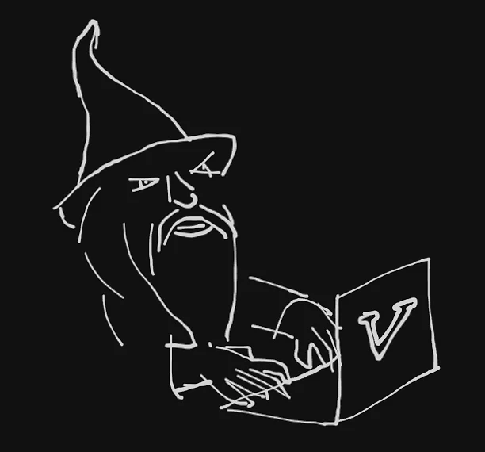

Nothing beats the dissatisfaction of not being able to get faster at something you enjoy doing.
Knowing very well that increasing your pace will drastically improve your competence. That was me before I
experienced the magic of using Vim motions. And now, almost a month later, I can't live without it.
The journey of becoming a Vim wizard comes at a cost, apparently.



If you're not already aware, Vim is a text-editor which rests on _"the keyboard is all you need"_ philosophy.
It employs an ingenious technique (referred to as motions) which allows users to move around and edit a block of
text without the need of a mouse.

It is not compulsory for you to use Vim as your text-editor to learn Vim
motions. You can use any editor of your choice which provides support for a Vim plugin.
If you're like me and love using VSCode, you'd need to install the [Vim extension](https://github.com/VSCodeVim/Vim).

Before we get started, I feel compelled to emphasize the importance of touch typing in this context.
It is an invaluable skill for people like me who spend hours fiddling with computers
on a daily basis. While touch typing allows you to _type_ at the speed you think, Vim empowers
you to _edit_ your text with the same efficiency. I do not intend this to be a Vim tutorial but rather a guide to
understand the intuition behind Vim motions. Hence, I will not be going over commands or features that do
not contribute towards our objective. And yes, that also includes exiting the editor.

> Vim may not be productive for you if you do not touch type. A strong muscle memory is crucial for building
> up speed and effectiveness.

### Modes

Unlike other editors, Vim has modes, which are perspectives that segregates the actions of editing and text
input, with the ability to switch between them as necessary. The most important ones are -

1. <span style="color: bisque;">Normal Mode</span>

   This is the default mode in Vim,
   which enables the user to navigate through the document, primarily by using the home row keys of `j`, `k`
   `l` and `k` for moving down, up, right and left respectively. Other keys such as `w` (also `e`) or `b` for
   moving forward and backwards by a word, `{` and `}` for moving up and down empty lines, etc. make it super
   easy to jump from one line to another (These are called [_movements_](#movements) and are discussed later). This mode is special since other editing modes can be entered only
   through the Normal Mode. The `Esc` key is reserved by default to enter Normal Mode from other modes.

2. <span style="color: bisque">Insert Mode</span>

   The Insert Mode is where Vim behaves like any other text editor by allowing us to input and manipulate text.
   We can enter it by pressing `i` (insert to the left of current position) or `a` (insert to the right of
   current position).

3. <span style="color: bisque">Visual Mode</span>

   To remove the need of selecting a block of text by holding down the mouse like we're familiar with,
   Vim has the Visual Mode. It essentially has two important sub-modes, the Character Visual Mode (`v`)
   and the Line Visual Mode (`V`). The former allows the flexibility to select every character starting from
   the current cursor position while the latter selects each line individually. The `o` key allows our cursor
   to move from one end of the selected block to the other.

4. <span style="color: bisque">Command Mode</span>{" "}

   This mode is reserved for entering commands in the Vim editor's command line. It can be entered by pressing
   `:` or `/` to perform certain tasks like saving a file (`:w`) or performing search (`/word`)
   and replace (`:%s/old/new`) operations. Vim boasts plenty of other commands which are not very useful if you're
   not working on the Vim editor itself.

Additional modes like Replace or Terminal also exist, but they've been of little practical use to me as far as
Vim motions are concerned.

### The Grammar

Motions started to make way more sense once I realized they could be deconstructed as lexical items
in a human language. Vim is based on a meticulous system of _nouns_, _verbs_ and _movements_
that combine together to create motions, much like sentences. Let's explore
this further to grasp their incredible power.

#### Movements

_Movements_, in simple terms, are the keys that make the cursor move in Normal Mode. These include the
home-row keys (`j`, `k`, `h`, `l`), word-movement keys (`w`, `e`, `b`), line-movement keys -

1. `0` move to start of line
2. `$` move to the end of line
3. `gg` move to the first line of file
4. `G` move to the last line of file
5. `(` move backwards to the start of each sentence
6. `)` move forwards to the start of each sentence
7. `%` move to the opposite matching brace

and 4 special movement keys, which I like to call c-moves -

1. `t` (till character)
2. `f` (to character)
3. `T` (till character backwards)
4. `F` (to character backwards)

These c-moves require a second argument as their target character.

```
(c-move)(character)
```

For example, `ti` moves the cursor forward to the position before the first occurrence of the character `i` in the
current line. Similarly, `Fg` moves the cursor backwards to the position of the first occurrence of the character
`g` in the current line.

#### Nouns and Verbs

Nouns are targets (words, paragraphs, etc.) against which we perform a particular action (_verb_), like
copying/deleting or selecting text. They include -

1. `w` (word)
2. `p` (paragraph)
3. `s` (sentence)
4. `(` (also b for parentheses)
5. `{` (also B for curly braces)
6. `"` (double quotes)
7. `[` (square brackets)
8. `` ` `` (back ticks)
9. `t` (HTML tags)

with the verbs being -

1. `d` (delete)
2. `c` (change)
3. `y` (yank or copy)
4. `v` (select)

The _delete_ and _change_ verbs have only one distinction. _Delete_ removes a noun and preserves
the Normal mode while _change_ removes a Noun and enters Insert Mode.

#### Motions

We can combine a _verb_ and a _movement_ to produce a motion.
For example, `dw` (delete a word when cursor is in the beginning) becomes a _verb_ + _movement_ motion.
It is important to note that in this case, `w` is the _word-movement_ and not the _word-noun_.
We can substitute any _verb_ with a _movement_ to carry out an action. We can also include a number called _count_
after the _verb_ to specify the length of characters or lines that will be modified by the action. For example,
`d4j` deletes 4 lines down from the current cursor position, since `j` is the downwards
movement key.

```
(verb){count}(movement)
```

_C-moves_ help create more precise motions. They can be implemented in the following structure.

```
(verb){count}(c-move)(character)
```

- `dt.` delete everything from current cursor position till the first occurrence of a `.`
- `vfo` select everything from current cursor position to the first occurrence of a `o`
- `yF-` copy/yank everything _backwards_ from current cursor position to the first occurrence of a `-`
- `d3fy` delete everything from current cursor position till the first 3 occurrences of `y`

Nouns do not produce motions with verbs. This is because nouns are a little
special and require the addition of, what I like to call a wrap-specifier, to help define our motion accurately.

#### Compounding motions using wrap-specifiers

Good things come in pairs, so do wrap-specifiers.

1. `i` (inside)
2. `a` (around)

The `i` specifier is used to instruct the verb to perform the motion inside the noun, while
`a` is used to perform the motion around it. It usually follows the given structure.

```
(verb){count}(specifier)(noun)
```

Here are a few examples.

- `daw` _deletes_ the _current word_ from any cursor position along with the adjacent space, hence _around_.
- `ciw` _changes_ (deletes and inserts) the _current word_ from any cursor position without removing the adjacent
  space, hence _inside_.
- `dab` _deletes around_ a pair of _parentheses_ (b also means ()), resulting in the removal of everything
  inside the braces along with the braces itself.
- `yip` _yanks/copies inside_ the current _paragraph_, resulting in a block of text without any surrounding
  line-breaks.
- `v3as` _selects around three sentences_ to the right including the current sentence and a trailing space.

That's pretty much all we need to know to construct complex motions of our own.

### Macros

Macros are a lifesaver, when implemented correctly. They consist of a pre-recorded set of keystrokes
that can be used to perform repetitive tasks. Like appending a specific phrase on every
line or inserting line-breaks after a definite interval of characters. It works by mapping a key to the
recorded motion which can be called later and re-used throughout the document.

To start recording a macro (in Normal Mode), we press the `q` key followed by any key of our choice (say `e`) as
the key we want to map our macro to. Once we execute that, we will notice

> Recording @e

on the command line of our editor. From this point onwards, every keystroke we make will be recorded as a
macro-move till we press the `q` key again to end the recording. To utilize or call this macro, we need to
press the `@` key followed by the key we mapped our macro to, in our case `e`. This will modify the document
from our current cursor position in the order of the recorded keystrokes.

### Tricks

Here are probably my top 10 favourite motions, in no particular order.

1. There are two commands that are indispensable. `daw` and `ciw`. They both do the same job, which is
   deleting a word, but in slightly different ways.

2. `I` and `A`. They move your cursor to the beginning and end of the current line
   respectively. Quick and extremely useful.

3. If you need to jump to a word that's a few words down the line, but don't want to bother having to hold
   down `w` or `e`, fret not. Simply `/word` (till you match the word uniquely), hit enter and you'll be teleported to the first character of the
   word in your current line, even if the same word exists multiple times in the document. And if the word
   lies before your current cursor position, replace `/` with `?`

4. `cc` to delete and insert in the current line.

5. Nobody likes using `d$` to delete from the current cursor position till the end of line. Instead, use
   `D`

6. `bi` to insert in front of the current word and `ea` to insert behind it. Priceless moves.

7. To replace a character without having to go to insert mode, press `r` over the character you want
   to replace followed by the new character.

8. Now this is exclusively for a programming scenario. If you're on a variable and need to find the line where
   it was declared, press `gd` over the word and your cursor will instantly jump to the desired line.

9. I knew I wasn't a newbie anymore when I noticed that performing a delete or change operation is equivalent to
   cutting and that there wasn't a separate key combination for it.

10. Marking is easily the coolest feature in Vim. It works a bit like macros by mapping a character to a
    particular line which you can call later and jump to. Let me explain this better. Say you find yourself
    visiting line 481 quite frequently. Instead of having to type `:481` on the command line to jump each time,
    you can instead mark the line using the command `m(character)` against a character of your choice, say `a`.
    Now whenever you need to jump to line 481, all you need to do is `'(character)`, or in our case `'a` from
    anywhere on the document. Isn't that stupidly simple?

I compiled a non-exhaustive list of useful Vim commands in this [Github Repository](https://github.com/swagatmitra-b/essential-vim).
Also, here's an awesome [twitter page](https://twitter.com/vim_tricks) for you.

You can check them out if you like :)

### Conclusion

Vim motions have been unreasonably impactful in the way I write code now. The only downside of _Vim-ing hard_ is
it induces a subtle restlessness in your fingers once you start getting the hang of it. Something that doesn't
wear off easily. At least, not when you're consistently typing over a hundred words every day. Perhaps slowing
down will save you the dread of losing your phalanges over time, or maybe it's just me. I haven't a clue. But
nevertheless, I've loved very minute I've Vim-med and there's just no going back. Remember, it demands a good
deal of practice before you find yourself whizzing through your code-base like a golden snitch. So get
your knuckles cracking and Vim on!

<div class="flex w-full justify-end text-[#c4c1b9] italic mt-28">
  <p class="w-1/2">
    Finished in my dorm room (8052), after a week of feverish anticipation for
    nothing
  </p>
</div>
